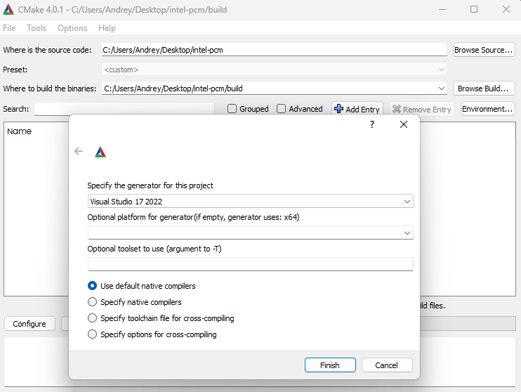
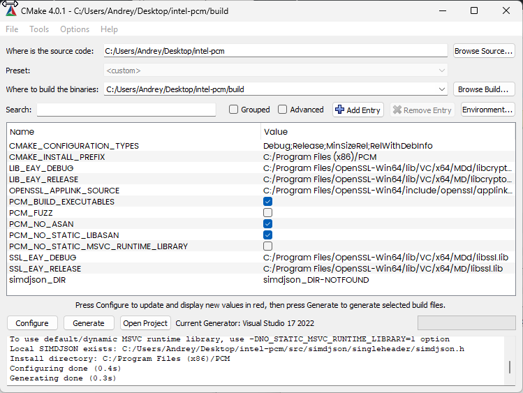
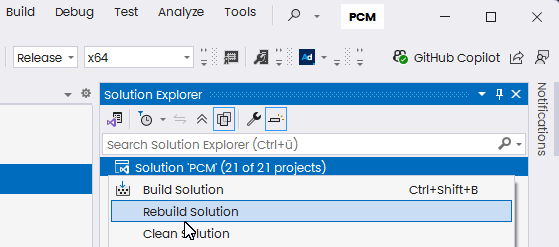
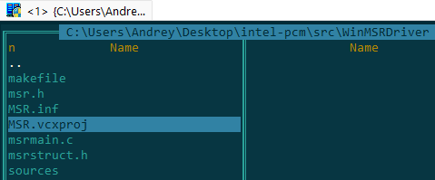
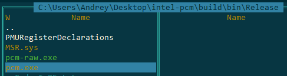

--------------------------------------------------------------------------------
Intel&reg; Performance Counter Monitor (Intel&reg; PCM)
--------------------------------------------------------------------------------

Forked from [intel/pcm](https://github.com/intel/pcm) for build purposes

## Build Notes

Execute git clone https://github.com/simdjson/simdjson.git in \src folder if needed

Build Configuration:



Configure->Generate, everything by default



Open Project, rebuild in Release x64:



All right:

```
20>pcm.vcxproj -> C:\Users\Andrey\Desktop\intel-pcm\build\bin\Release\pcm.exe
20>Done building project "pcm.vcxproj".
6>pcm-raw.vcxproj -> C:\Users\Andrey\Desktop\intel-pcm\build\bin\Release\pcm-raw.exe
6>Done building project "pcm-raw.vcxproj".
21>------ Skipped Rebuild All: Project: ALL_BUILD, Configuration: Release x64 ------
21>Project not selected to build for this solution configuration 
========== Rebuild All: 20 succeeded, 0 failed, 1 skipped ==========
========== Rebuild completed at 09:25 and took 01:40,262 minutes ==========
```

Open MSR Project:



SDK and WDK should be installed, of course (refer to [WINDOWS_HOWTO.md](doc/WINDOWS_HOWTO.md)).

```
Rebuild started at 09:28...
1>------ Rebuild All started: Project: MSR, Configuration: Release x64 ------
1>Building 'MSR' with toolset 'WindowsKernelModeDriver10.0' and the 'Universal' target platform.
1>msrmain.c
1>MSR.vcxproj -> C:\Users\Andrey\Desktop\intel-pcm\src\WinMSRDriver\x64\Release\MSR.sys
1>Done Adding Additional Store
1>Successfully signed: C:\Users\Andrey\Desktop\intel-pcm\src\WinMSRDriver\x64\Release\MSR.sys
1>
1>Driver is 'Universal'.
1>Inf2Cat task was skipped as there were no inf files to process
========== Rebuild All: 1 succeeded, 0 failed, 0 skipped ==========
========== Rebuild completed at 09:28 and took 03,093 seconds ==========
```

Copy sys near executable



To run you will need to disable Secure Boot in BIOS, turn off check for signing (bcdedit /set testsigning on and probably bcdedit /set nointegritychecks on), then reboot again, then run pcm.exe as Administrator, that is.

```
C:\Users\Andrey\Desktop\intel-pcm\build\bin\Release>pcm.exe
DEBUG: Setting Ctrl+C done.

 Intel(r) Performance Counter Monitor ($Format:%ci ID=%h$)

=====  Processor information  =====
Hybrid processor         : no
IBRS and IBPB supported  : yes
STIBP supported          : yes
Spec arch caps supported : no
Max CPUID level          : 13
CPU family               : 6
CPU model number         : 60
Number of physical cores: 4
Number of logical cores: 8
Number of online logical cores: 8
Threads (logical cores) per physical core: 2
Num sockets: 1
Physical cores per socket: 4
Last level cache slices per socket: 4
Core PMU (perfmon) version: 3
Number of core PMU generic (programmable) counters: 4
Width of generic (programmable) counters: 48 bits
Number of core PMU fixed counters: 3
Width of fixed counters: 48 bits
Nominal core frequency: 3300000000 Hz
IBRS enabled in the kernel   : no
STIBP enabled in the kernel  : no
Package thermal spec power: 57 Watt; Package minimum power: 0 Watt; Package maximum power: 0 Watt;

Socket 0: 0 PCU units detected. 0 IIO units detected. 0 IRP units detected. 0 CHA/CBO units detected.
0 MDF units detected. 0 UBOX units detected. 0 CXL units detected. 0 PCIE_GEN5x16 units detected.
0 PCIE_GEN5x8 units detected.

Detected Intel(R) Core(TM) i7-4940MX CPU @ 3.10GHz "Intel(r) microarchitecture codename Haswell"
stepping 3 microcode level 0x28

 UTIL  : utlization (same as core C0 state active state residency, the value is in 0..1)
 IPC   : instructions per CPU cycle
 CFREQ : core frequency in Ghz
 L3MISS: L3 (read) cache misses
 L2MISS: L2 (read) cache misses (including other core's L2 cache *hits*)
 L3HIT : L3 (read) cache hit ratio (0.00-1.00)
 L2HIT : L2 cache hit ratio (0.00-1.00)
 L3MPI : number of L3 (read) cache misses per instruction
 L2MPI : number of L2 (read) cache misses per instruction
 READ  : bytes read from main memory controller (in GBytes)
 WRITE : bytes written to main memory controller (in GBytes)
 IO    : bytes read/written due to IO requests to memory controller (in GBytes);
         this may be an over estimate due to same-cache-line partial requests
 IA    : bytes read/written due to IA requests to memory controller (in GBytes);
         this may be an over estimate due to same-cache-line partial requests
 GT    : bytes read/written due to GT requests to memory controller (in GBytes);
         this may be an over estimate due to same-cache-line partial requests
 TEMP  : Temperature reading in 1 degree Celsius relative to the TjMax temperature (thermal headroom):
         0 corresponds to the max temperature
 energy: Energy in Joules


 Core (SKT) | UTIL | IPC  | CFREQ | L3MISS | L2MISS | L3HIT | L2HIT | L3MPI | L2MPI |  TEMP

   0    0     0.08   0.42    3.68    1182 K   5104 K    0.77    0.43  0.0091  0.0393     48
   1    0     0.05   0.52    3.65     604 K   4333 K    0.86    0.45  0.0059  0.0424     48
   2    0     0.10   0.58    3.71    1276 K   9135 K    0.86    0.38  0.0058  0.0416     48
   3    0     0.06   0.53    3.72    1102 K   3598 K    0.69    0.32  0.0095  0.0310     48
   4    0     0.12   0.63    3.72    1279 K   7108 K    0.82    0.37  0.0047  0.0261     49
   5    0     0.04   0.50    3.68     503 K   2992 K    0.83    0.42  0.0062  0.0366     49
   6    0     0.05   0.35    3.61     790 K   4252 K    0.81    0.35  0.0118  0.0634     51
   7    0     0.03   0.51    3.60     410 K   2056 K    0.80    0.48  0.0066  0.0330     51
--------------------------------------------------------------------------------------------
 SKT    0     0.07   0.52    3.68    7149 K     38 M    0.81    0.39  0.0068  0.0367     46
--------------------------------------------------------------------------------------------
 TOTAL  *     0.07   0.52    3.68    7149 K     38 M    0.81    0.39  0.0068  0.0367     N/A

 Instructions retired: 1051 M ; Active cycles: 2014 M ; Time (TSC): 3313 Mticks;

 Core C-state residencies: C0 (active,non-halted): 6.81 %; C1: 21.42 %; C3: 1.85 %;
 C6: 0.00 %; C7: 69.92 %;
 Package C-state residencies:  C0: 58.39 %; C2: 41.61 %; C3: 0.00 %; C6: 0.00 %; C7: 0.00 %;
 C-State distribution:
                 ┌───────────────────────────────────────────────────────────────────────────────┐
 Core    C-state │0000011111111111111111377777777777777777777777777777777777777777777777777777777│
                 └───────────────────────────────────────────────────────────────────────────────┘
                 ┌────────────────────────────────────────────────────────────────────────────────┐
 Package C-state │00000000000000000000000000000000000000000000000222222222222222222222222222222222│
                 └────────────────────────────────────────────────────────────────────────────────┘
---------------------------------------------------------------------------------------------------

MEM (GB)->|  READ |  WRITE |   IO   |   IA   |   GT   | CPU energy | PP0 energy | PP1 energy |
---------------------------------------------------------------------------------------------------
 SKT   0     0.76     0.21     0.15     0.76     0.07      13.01       6.55       0.11
---------------------------------------------------------------------------------------------------

 UTIL  : utlization (same as core C0 state active state residency, the value is in 0..1)
 ...
```

I’m not understand, why INTEL didn’t provided signed MSR.sys as well as whole build in convenient form.

---

[](https://github.com/intel/pcm/security/code-scanning/tools/CodeQL/status)
[](https://securityscorecards.dev/viewer/?uri=github.com/intel/pcm)
[](https://www.bestpractices.dev/projects/8652)

[PCM Tools](#pcm-tools) | [Building PCM](#building-pcm-tools) | [Downloading Pre-Compiled PCM](#downloading-pre-compiled-pcm-tools) | [FAQ](#frequently-asked-questions-faq) | [API Documentation](#pcm-api-documentation) | [Environment Variables](#pcm-environment-variables) | [Compilation Options](#custom-compilation-options)

Intel&reg; Performance Counter Monitor (Intel&reg; PCM) is an application programming interface (API) and a set of tools based on the API to monitor performance and energy metrics of Intel&reg; Core&trade;, Xeon&reg;, Atom&trade; and Xeon Phi&trade; processors. PCM works on Linux, Windows, Mac OS X, FreeBSD, DragonFlyBSD and ChromeOS operating systems.

*Github repository statistics:*   

We welcome bug reports and enhancement requests, which can be submitted via the "Issues" section on GitHub. For those interested in contributing to the code, please refer to the guidelines outlined in the CONTRIBUTING.md file.

--------------------------------------------------------------------------------
Current Build Status
--------------------------------------------------------------------------------

- Linux: [](https://github.com/intel/pcm/actions/workflows/linux_make.yml?query=branch%3Amaster)
- Windows: [](https://ci.appveyor.com/project/opcm/pcm)
- FreeBSD: [](https://github.com/intel/pcm/actions/workflows/freebsd_build.yml?query=branch%3Amaster)
- OS X: [](https://github.com/intel/pcm/actions/workflows/macosx_build.yml?query=branch%3Amaster)
- Docker container: [](doc/DOCKER_README.md)

--------------------------------------------------------------------------------
PCM Tools
--------------------------------------------------------------------------------

PCM provides a number of command-line utilities for real-time monitoring:

- **pcm** : basic processor monitoring utility (instructions per cycle, core frequency (including Intel(r) Turbo Boost Technology), memory and Intel(r) Quick Path Interconnect bandwidth, local and remote memory bandwidth, cache misses, core and CPU package sleep C-state residency, core and CPU package thermal headroom, cache utilization, CPU and memory energy consumption)


- **pcm-sensor-server** : pcm collector exposing metrics over http in JSON or Prometheus (exporter text based) format ([how-to](doc/PCM-EXPORTER.md)). Also available as a [docker container](doc/DOCKER_README.md). More info about Global PCM events is [here](doc/PCM-SENSOR-SERVER-README.md).
- **pcm-memory** : monitor memory bandwidth (per-channel and per-DRAM DIMM rank)

- **pcm-accel** : [monitor Intel® In-Memory Analytics Accelerator (Intel® IAA), Intel® Data Streaming Accelerator (Intel® DSA) and Intel® QuickAssist Technology (Intel® QAT)  accelerators](doc/PCM_ACCEL_README.md)


- **pcm-latency** : monitor L1 cache miss and DDR/PMM memory latency
- **pcm-pcie** : monitor PCIe bandwidth per-socket
- **pcm-iio** : [monitor PCIe bandwidth per PCIe bus/device](doc/PCM_IIO_README.md)


- **pcm-numa** : monitor local and remote memory accesses
- **pcm-power** : monitor sleep and energy states of processor, Intel(r) Quick Path Interconnect, DRAM memory, reasons of CPU frequency throttling and other energy-related metrics
- **pcm-tsx**: monitor performance metrics for Intel(r) Transactional Synchronization Extensions
- **pcm-core** and **pmu-query**: query and monitor arbitrary processor core events
- **pcm-raw**: [program arbitrary **core** and **uncore** events by specifying raw register event ID encoding](doc/PCM_RAW_README.md)
- **pcm-bw-histogram**: collect memory bandwidth utilization histogram

Graphical front ends:
- **pcm Grafana dashboard** :  front-end for Grafana (in [scripts/grafana](scripts/grafana) directory). Full Grafana Readme is [here](scripts/grafana/README.md)

- **pcm-sensor** :  front-end for KDE KSysGuard
- **pcm-service** :  front-end for Windows perfmon

There are also utilities for reading/writing model specific registers (**pcm-msr**), PCI configuration registers (**pcm-pcicfg**), memory mapped registers (**pcm-mmio**) and TPMI registers (**pcm-tpmi**) supported on Linux, Windows, Mac OS X and FreeBSD.

And finally a daemon that stores core, memory and QPI counters in shared memory that can be be accessed by non-root users.

--------------------------------------------------------------------------------
Building PCM Tools
--------------------------------------------------------------------------------

Clone PCM repository with submodules:

```
git clone --recursive https://github.com/intel/pcm
cd pcm
```

or clone the repository first, and then update submodules with:

```
git submodule update --init --recursive
```

Install cmake (and libasan on Linux) then:

```
mkdir build
cd build
cmake ..
cmake --build .
```
You will get all the utilities (pcm, pcm-memory, etc) in `build/bin` directory.
'--parallel' can be used for faster building:
```
cmake --build . --parallel
```
Debug is default on Windows. Specify config to build Release:
```
cmake --build . --config Release
```
On Windows and MacOs additional drivers and steps are required. Please find instructions here: [WINDOWS_HOWTO.md](doc/WINDOWS_HOWTO.md) and [MAC_HOWTO.txt](doc/MAC_HOWTO.txt).

FreeBSD/DragonFlyBSD-specific details can be found in [FREEBSD_HOWTO.txt](doc/FREEBSD_HOWTO.txt)


--------------------------------------------------------------------------------
Downloading Pre-Compiled PCM Tools
--------------------------------------------------------------------------------

- Linux:
  * Ubuntu/Debian: `sudo apt install pcm`
  * openSUSE: `sudo zypper install pcm`
  * RHEL8.5 or later: `sudo dnf install pcm` 
  * Fedora: `sudo yum install pcm`
  * RPMs and DEBs with the *latest* PCM version for RHEL/SLE/Ubuntu/Debian/openSUSE/etc distributions (binary and source) are available [here](https://software.opensuse.org/download/package?package=pcm&project=home%3Aopcm)
- Windows: download PCM binaries as [appveyor build service](https://ci.appveyor.com/project/opcm/pcm/history) artifacts and required Visual C++ Redistributable from [www.microsoft.com](https://www.microsoft.com/en-us/download/details.aspx?id=48145). Additional steps and drivers are required, see [WINDOWS_HOWTO.md](doc/WINDOWS_HOWTO.md).
- Docker: see [instructions on how to use pcm-sensor-server pre-compiled container from docker hub](doc/DOCKER_README.md).

--------------------------------------------------------------------------------
Executing PCM tools under non-root user on Linux
--------------------------------------------------------------------------------

Executing PCM tools under an unprivileged user on a Linux operating system is feasible. However, there are certain prerequisites that need to be met, such as having Linux perf_event support for your processor in the Linux kernel version you are currently running. To successfully run the PCM tools, you need to set the `/proc/sys/kernel/perf_event_paranoid` setting to -1 as root once:

```
echo -1 > /proc/sys/kernel/perf_event_paranoid
```

and configure two specific environment variables when running the tools under a non-root user:

```
export PCM_NO_MSR=1
export PCM_KEEP_NMI_WATCHDOG=1
```

For instance, you can execute the following commands to set the environment variables and run pcm:

```
export PCM_NO_MSR=1
export PCM_KEEP_NMI_WATCHDOG=1
pcm
```

or (to run the pcm sensor server as non-root):

```
PCM_NO_MSR=1 PCM_KEEP_NMI_WATCHDOG=1 pcm-sensor-server
```

Please keep in mind that when executing PCM tools under an unprivileged user on Linux, certain PCM metrics may be unavailable. This limitation specifically affects metrics that rely solely on direct MSR (Model-Specific Register) register access. Due to the restricted privileges of the user, accessing these registers is not permitted, resulting in the absence of corresponding metrics.

--------------------------------------------------------------------------------
Frequently Asked Questions (FAQ)
--------------------------------------------------------------------------------

PCM's frequently asked questions (FAQ) are located [here](doc/FAQ.md).

--------------------------------------------------------------------------------
PCM API documentation
--------------------------------------------------------------------------------

PCM API documentation is embedded in the source code and can be generated into html format from source using Doxygen (www.doxygen.org).

--------------------------------------------------------------------------------
PCM environment variables
--------------------------------------------------------------------------------

The list of PCM environment variables is located [here](doc/ENVVAR_README.md)

--------------------------------------------------------------------------------
Custom compilation options
--------------------------------------------------------------------------------
The list of custom compilation options is located [here](doc/CUSTOM-COMPILE-OPTIONS.md)

--------------------------------------------------------------------------------
Packaging
--------------------------------------------------------------------------------
Packaging with CPack is supported on Debian and Redhat/SUSE system families.
To create DEB of RPM package need to call cpack after building in build folder:
```
cd build
cpack
```
This creates package:
- "pcm-VERSION-Linux.deb" on Debian family systems;
- "pcm-VERSION-Linux.rpm" on Redhat/SUSE-family systems.
Packages contain pcm-\* binaries and required for usage opCode-\* files.
